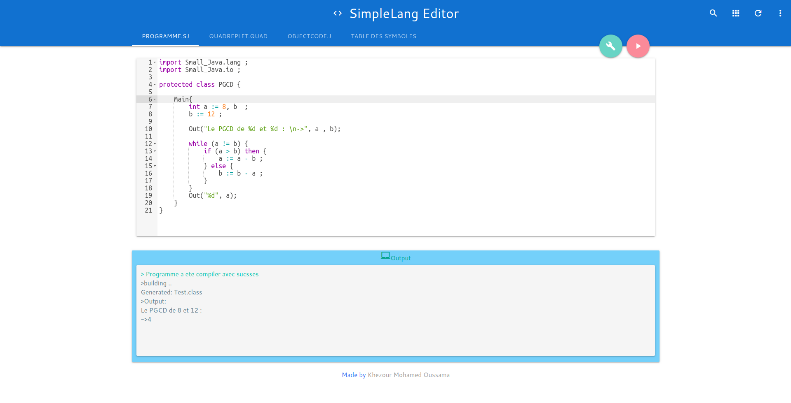
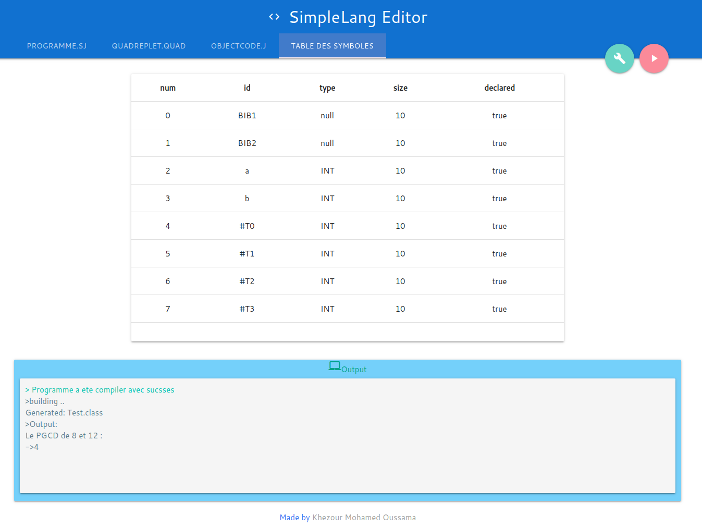
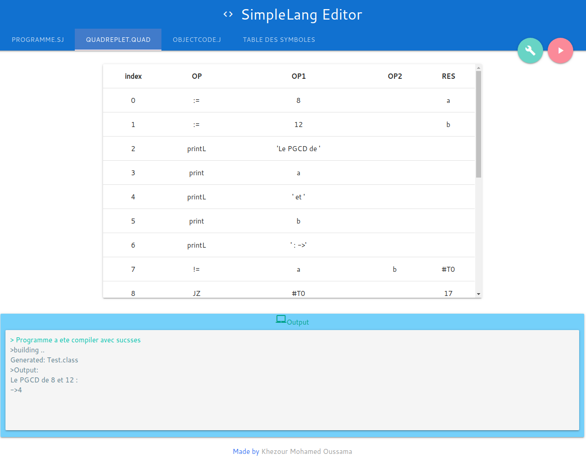

# JVM Simple Lang
a little language that runs on the JVM and uses Quadruples as an intermediate Code 

## Technologies
this project is created with:
* ANTLR: www.antlr.org
* Jasmin: http://jasmin.sourceforge.net/
* Vue.js: www.vuejs.org
* aceEditor : https://github.com/ajaxorg/ace
* Tomcat 9.0.30 

## Symbole Table

## Quadruples

It is structure with consist of 4 fields namely op, arg1, arg2 and result. op denotes the operator and arg1 and arg2 denotes the two operands and result is used to store the result of the expression.

## Jasmin generated code

Jasmin is an assembler for the Java Virtual Machine. It takes ASCII descriptions of Java classes, written in a simple assembler-like syntax using the Java Virtual Machine instruction set. It converts them into binary Java class files, suitable for loading by a Java runtime system.

check http://jasmin.sourceforge.net/

## Exemples

check the `exemples` folder

## Note 
##### tested only on Linux  !

